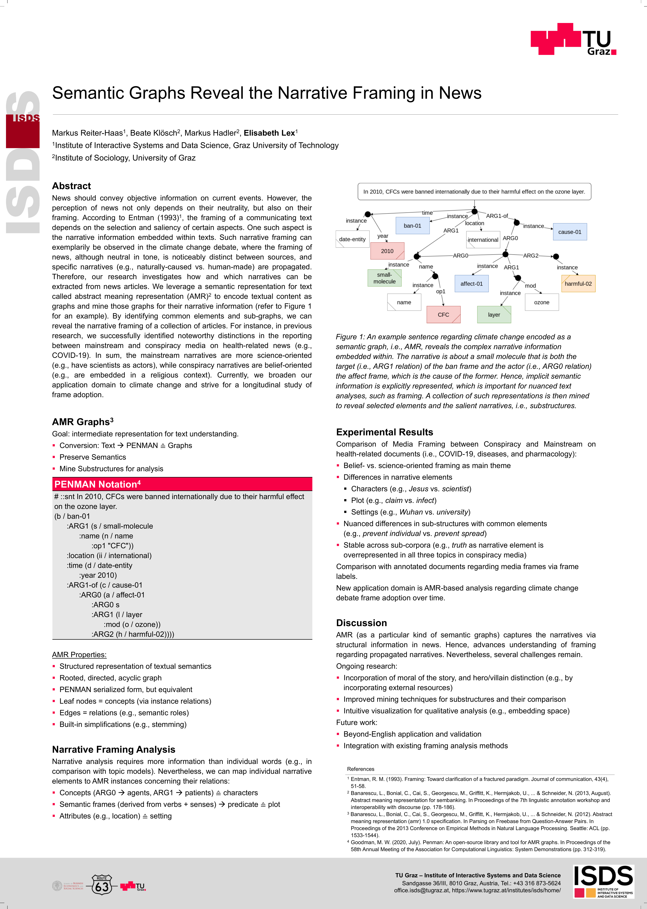
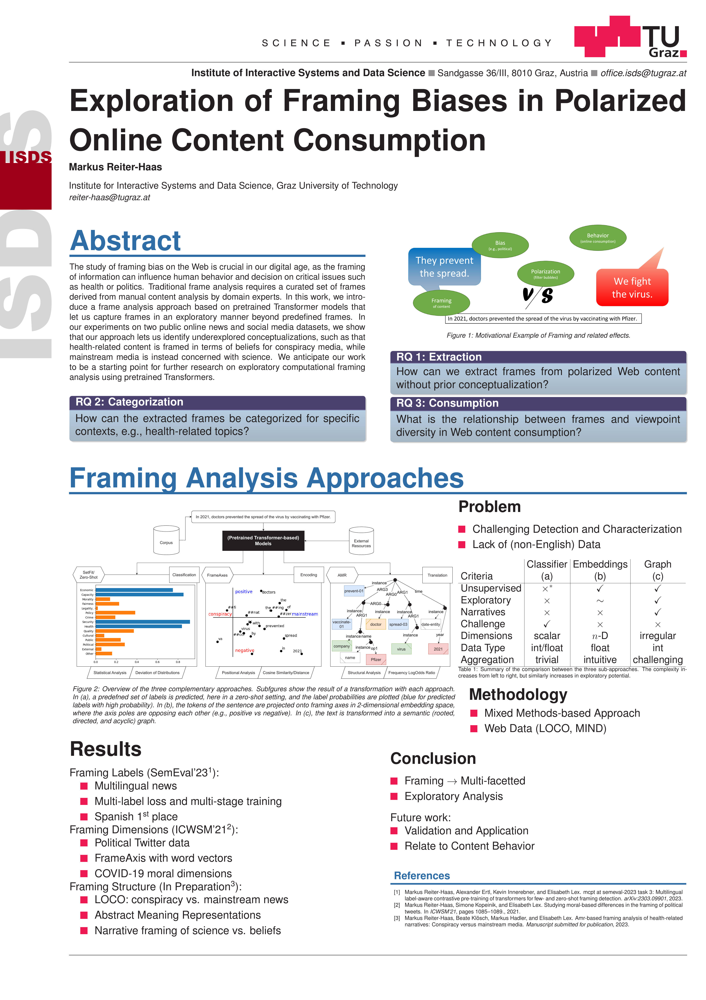
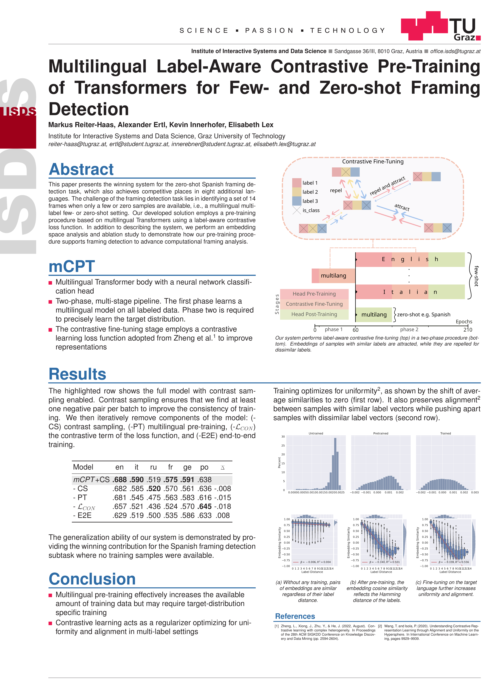
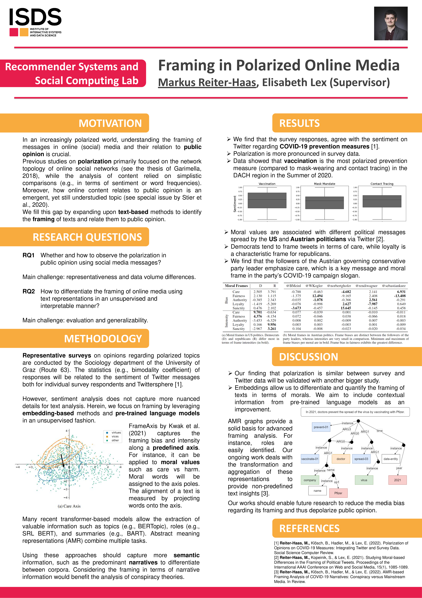
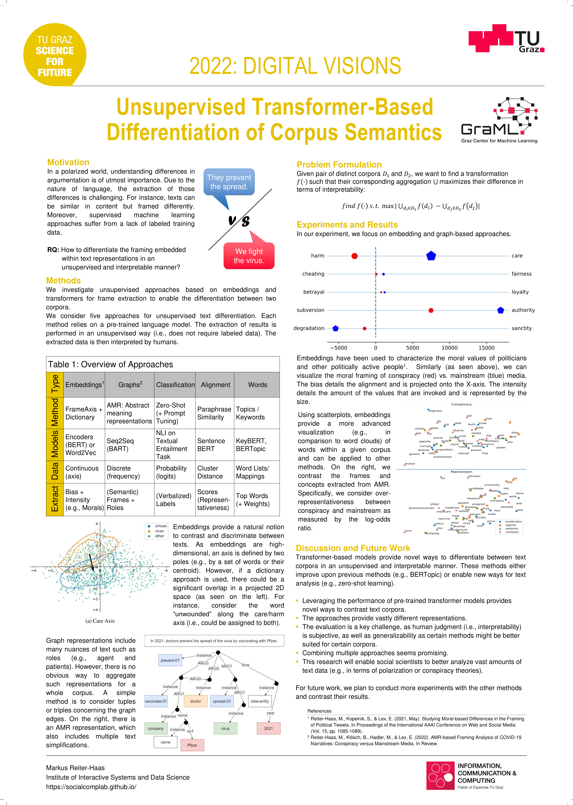
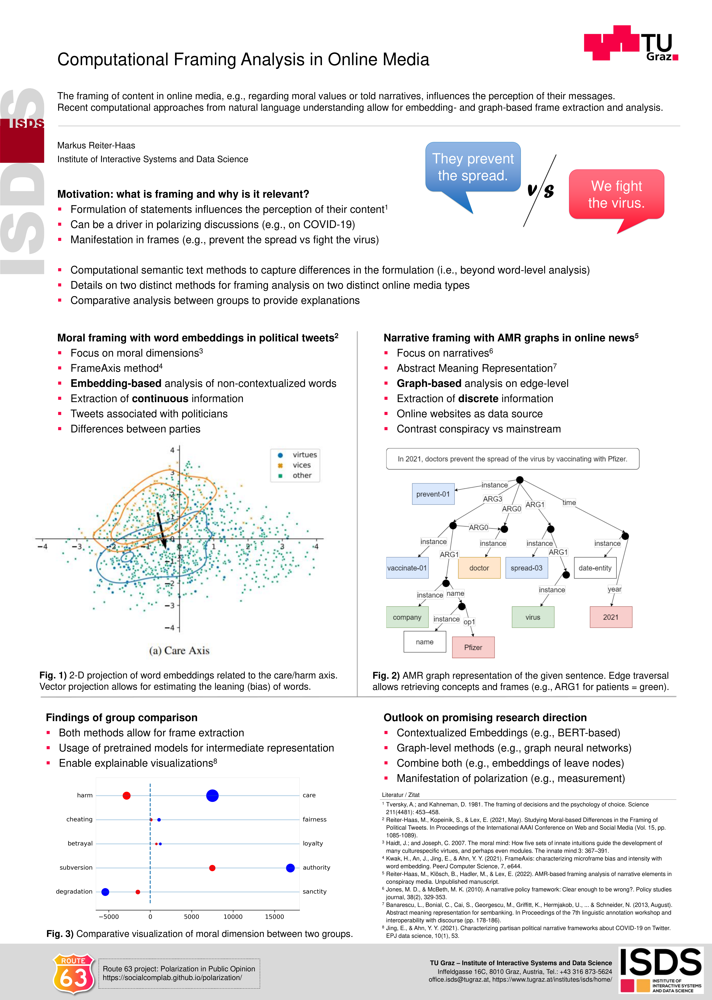
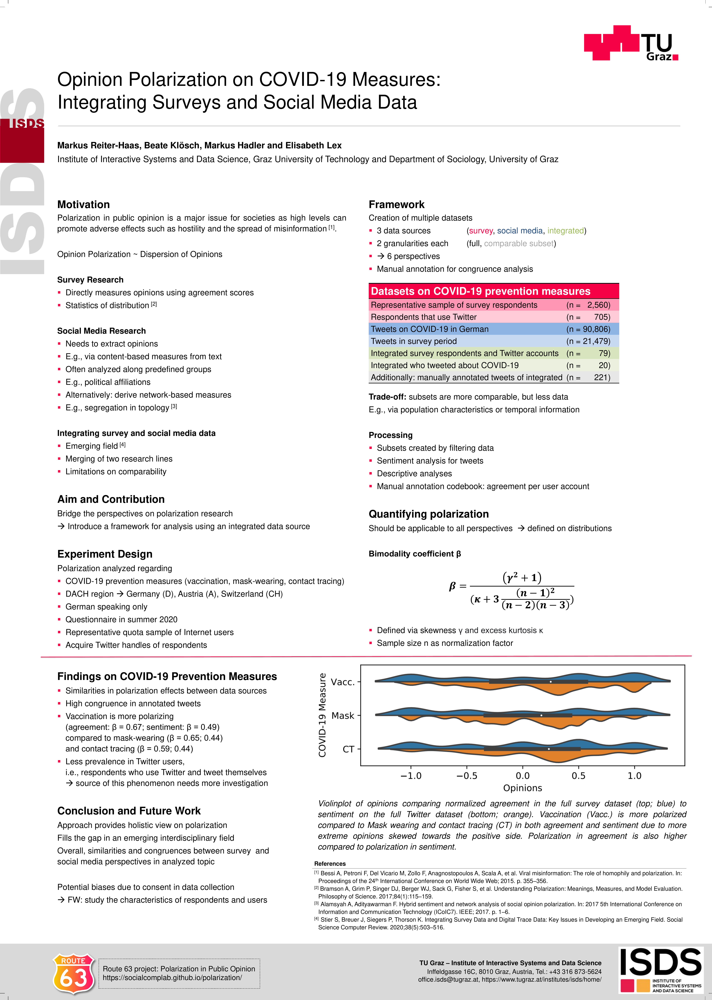
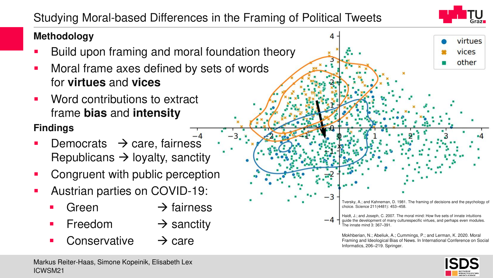

---
---

# List of materials
> E.g., presentation slides

## Posters

### 2023

<table>
    <tr>
        <th>Semantic Graphs Reveal the Narrative Framing in News</th>
        <th>Exploration of Framing Biases in Polarized Online Content Consumption</th>
        <th>Multilingual Label-Aware Contrastive Pre-Training of Transformers for Few- and Zero-shot Framing Detection</th>
    </tr>
    <tr>
        <td></td>
        <td></td>
        <td></td>
    </tr>
</table>

### 2022

<table>
    <tr>
        <th>Framing in Polarized Online Media</th>
        <th>Unsupervised Transformer-Based Differentiation of Corpus Semantics</th>
        <th>Computational Framing Analysis in Online Media</th>
    </tr>
    <tr>
        <td></td>
        <td></td>
        <td></td>
    </tr>
</table>

### 2021

<table>
    <tr>
        <th>Opinion Polarization on COVID-19 Measures: Integrating Surveys and Social Media Data</th>
        <th>Studying Moral-based Differences in the Framing of Political Tweets</th>
    </tr>
    <tr>
        <td></td>
        <td></td>
    </tr>
</table>

## Presentations

Under construction
